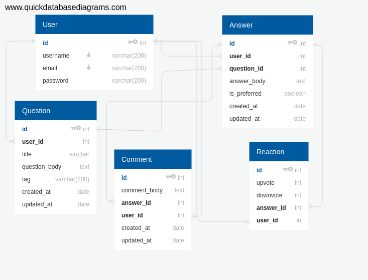

## Build Status
[](https://travis-ci.org/wiztemple/kommunity)
[](https://coveralls.io/github/wiztemple/kommunity?branch=develop)
[](https://codeclimate.com/github/wiztemple/kommunity/maintainability)


# Kommunity
kommunity is a platform where people can ask questions and provide answers. A light weight StackOverflow with a Quora feel. :speech_balloon: :thought_balloon: :man: :woman: :boy: :girl: :pencil2:

## Features

### Authentication

* It uses JSON Web Token (JWT) for authentication.  :lock:
* Token is generated on user login or when a new user signup :closed_lock_with_key:
* Token is verified to check the state of the user if logged in or not.
* Token expires after 24 hours :clock12:

### Unauthenticated Users

* Unauthenticated Users can view the landing and see how the app works :eyes:
* Unauthenticated Users can register :bust_in_silhouette:
* Unauthenticated Users can view answers to questions :neutral_face: :eyes:
* Unauthenticated Users can view questions with the most answers :eyes:
* Unauthenticated Users can search for questions on the platform :mag: :mag_right:

### Authenticated Users

* Authenticated Users can log in :bust_in_silhouette: :busts_in_silhouette:
* Authenticated Users can post questions :outbox_tray:
* Authenticated Users can view answers to questions :neutral_face: :eyes:
* Authenticated Users can post answers :pencil: :outbox_tray:
* Authenticated Users can delete the questions they post :x:
* Authenticate Users can accept an answer out of all the answers to his/her question as the preferred answer :point_right: :heavy_check_mark:
* Authenticated Users can upvote or downvote an answer :+1: :-1:
* Authenticated Users can comment on an answer :speech_balloon:
* Authenticated Users can fetch all questions he/she has ever asked on the platform :date:
* Authenticated Users can view their account details :bust_in_silhouette:
* Authenticated Users can edit their account details :bust_in_silhouette:

## Endpoints

| Request Type | Endpoint | Action :arrow_upper_right:|
| ------- | -------- | ------ |
| POST | _/api/v1/auth/signup_ | Signup a user
| POST | _/api/v1/auth/login_ | Login a user
| POST | _/api/v1/questions_ | Create question
| GET  | _/api/v1/questions_ | Get all questions
| GET  | _/api/v1/questions/auth_ | Get all questions belonging to a specified user
| GET  | _/api/v1/questions/:id_ | Get a single question
| PUT  | _/api/v1/questions/:id_ | Edit a question
| POST | _/api/v1/questions/:id/answer_ | Post answer to a question
| POST | _/api/v1/questions/:id/answer/:id/comment_ | Post comment to an answer
| DELETE | _/api/v1/questions/:id_ | Delete a question
| PUT | _/api/v1/questions/:id/answer/:id_ | Mark an answer as accepted or update an answer.

## Database Relationship


## Getting Started
Instructions to get the project running successfully on your terminal

### Prerequisites
You need to have these installed before cloning the project
* [Nodejs](https://nodejs.org/en/download/)

### Technologies Used
* [NodeJS](https://nodejs.org)
* [Express](https://expressjs.com)
* [Mocha](https://mochajs.org)
* [Chai](www.chaijs.com)
* [istanbul](https://istanbul.js.org)
* [Postgresql](https://www.postgresql.org/)

## Style Guide
 :smile: [BEM — Block Element Modifier](http://getbem.com/introduction/)

 :smile: [Airbnb JavaScript Style Guide](https://github.com/airbnb/javascript/)


## Installation
1. Install [**Node JS**](https://nodejs.org/en/).
2. Install [**Postgres**](https://www.postgresql.org/).
3. Clone the [**repository here**](https://github.com/wiztemple/kommunity.git)
4. [**cd**] into the root of the **project directory**.
5. Run `npm install` on the terminal to install Dependecies
6. Create Postgresql database, Navigate to server directory and run migrations:
```
cd kommunity
npm run create-table
```
7. Create a `.env` file in the root directory of the application. Use a different database for your testing and development. Example of the content of a .env file is shown in the .env.example

8. Start the application:
**_Different Build Environment_**

**Production**
```
npm start
```
**Development**
```
npm run dev
```
**Test**
```
npm test
```

## Testing

Sever side tests - Run `npm test` on the terminal while within the **project root directory**.
Server side testing is achieved through use of `supertest`, `mocha` and `chai` packages. `supertest` is used to make requests to the api and `mocha` is the testing framework and `chai` is the exception library. They will both be installed when you run `npm install` and the tests will run when you run `npm test`.

### Test the endpoints hosted on Heroku
  * [https://kommunity-app.herokuapp.com](https://kommunity-app.herokuapp.com)

## Acknowledgments
:clap: :clap: :clap: :clap: :+1: :+1: :smile:
* [Andela](http://andela.com) 
* [Stackoverflow](stackoverflow.com)
* [Medium](https://medium.com/@meakaakka/a-beginners-guide-to-writing-a-kickass-readme-7ac01da88ab3)
* [Dribbble](https://dribbble.com)

## Author
:large_blue_circle: :persevere: [Ukaegbu Sullivan Wisdom](http://github.com/wiztemple)

## License
This project is licensed under the **MIT** License