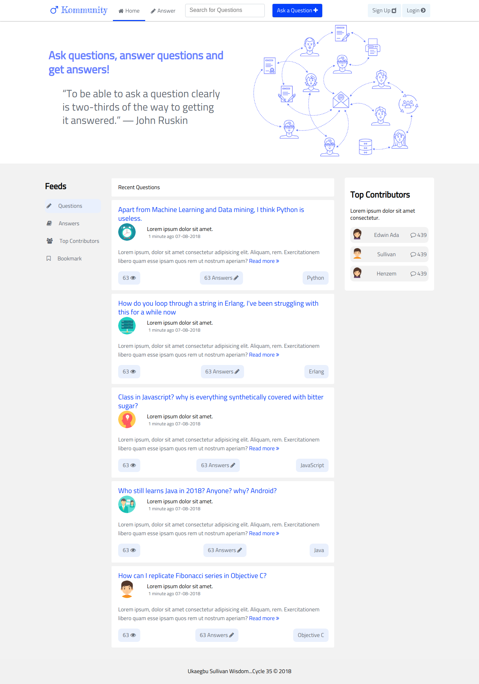

## Build Status
[](https://travis-ci.org/wiztemple/kommunity)
[](https://coveralls.io/github/wiztemple/kommunity?branch=develop)
[](https://codeclimate.com/github/wiztemple/kommunity/maintainability)
[](https://codeclimate.com/github/wiztemple/kommunity/test_coverage)

# Kommunity
kommunity is a platform where people can ask questions and provide answers. A light weight StackOverflow with a Quora feel. :speech_balloon: :thought_balloon: :man: :woman: :boy: :girl: :pencil2:

## Features
* Users can create an account and log in
* Users can post questions
* Users can delete the questions they post
* Users can post answers
* Users can view answers to questions
* Users can accept an answer out of all the answers to his/her question as the preferred answer
* Users can upvote or downvote an answer
* Users can comment on an answer
* Users can fetch all questions he/she has ever asked on the platform
* Users can search for questions on the platform
* Users can view questions with the most answers

## Getting Started
Instructions to get the project running successfully on your terminal

### Prerequisites
You need to have these installed before cloning the project
* _[NodeJS](https://nodejs.org/en/download/)_

### Technologies Used
* NodeJS
* Express
* Mocha
* Chai

## Style Guide
* [BEM — Block Element Modifier](http://getbem.com/introduction/).
* [Airbnb JavaScript Style Guide](https://github.com/airbnb/javascript/).
### Screenshots(App User Interface Template)


### How To Install
* _Clone from github_

  _```git clone https://github.com/wiztemple/kommunity.git```_
* _CD into the directory_
  _```cd kommunity```_
* _Install dependencies_
  _```npm install```_


### How To Run
  * _```npm run dev```_

### How To Test
  * _```npm test```_

## Acknowledgments
:clap: :clap: :clap: :clap: :+1: :+1:
* [Andela](http://andela.com) 
* [Stackoverflow](stackoverflow.com)
* [Medium](https://medium.com/@meakaakka/a-beginners-guide-to-writing-a-kickass-readme-7ac01da88ab3)
* [Dribbble](https://dribbble.com)

## Author
:large_blue_circle: :persevere: [Ukaegbu Sullivan Wisdom](http://github.com/wiztemple)

## License
This project is licensed under the **MIT** License